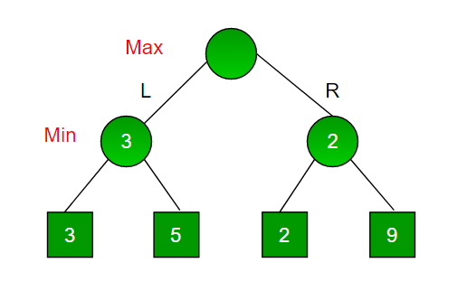
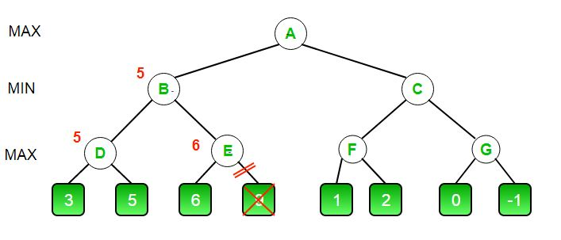
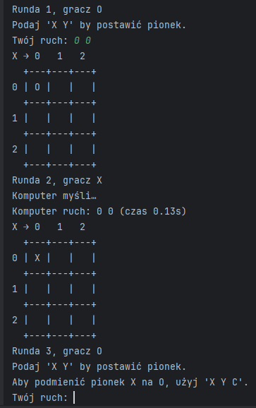
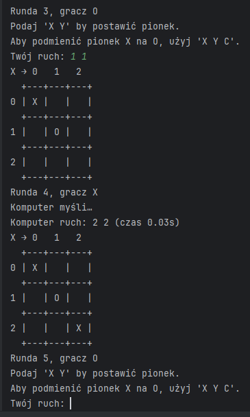
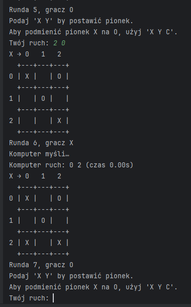
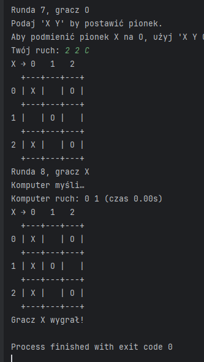

# Zmodyfikowane Kółko i Krzyżyk z Algorytmem MiniMax oraz przycinaniem alfa-beta

# Spis treści
- [Opis projektu](#opis-projektu)
- [Założenia gry i jej modyfikacje](#założenia-gry-i-jej-modyfikacje)
- [Pojęcia](#pojęcia)
  - [Algorytm MiniMax](#algorytm-minimax)
  - [Przycinanie Alfa-Beta](#przycinanie-alfa-beta)
- [Struktura projektu](#struktura-projektu) 
  - [1. Klasyczna gra w kółko i krzyżyk (bez AI)](#1-klasyczna-gra-w-kółko-i-krzyżyk-bez-ai)
  - [2. Modyfikacja gry z dodatkowym ruchem (swap)](#2-modyfikacja-gry-z-dodatkowym-ruchem-swap)
  - [3. Gra z AI opartym na MiniMax](#3-gra-z-ai-opartym-na-minimax)
  - [4. Gra z AI i przycinaniem alfa-beta](#4-gra-z-ai-i-przycinaniem-alfa-beta)
  - [5. Dokumentacja projektu](#5-dokumentacja-projektu)
  - [6. Pliki graficzne](#6-pliki-graficzne)
- [Szczegółowy opis działania programu](#szczegółowy-opis-działania-programu)
  - [Funkcje](#funkcje)
  - [Dokładne omówienie funkcji minimax](#dokładne-omówienie-funkcji-minimax)
  - [Ocena ruchów](#ocena-ruchów)
- [Instrukcja uruchomienia](#instrukcja-uruchomienia)
- [Przykładowe uruchomienia programu](#przykładowe-uruchomienia-programu)
- [Bibliografia i źródła](#bibliografia-i-źródła)

# Opis projektu

Projekt polega na zaimplementowaniu zmodyfikowanej wersji gry Kółko i Krzyżyk, z wykorzystaniem algorytmu MiniMax oraz techniki przycinania Alfa-Beta. Gra ma dodatkowy element – każdy gracz ma możliwość zamiany symbolu przeciwnika na swój, o ile nie jest to ruch wygrywający.

## Założenia gry i jej modyfikacje

- Kółko i Krzyżyk to gra, w której mamy 2 graczy oraz planszę 3x3. Jeden gracz to O a drugi to X. 

- Gracz O zaczyna, gra polega na naprzemiennym stawianiu swojego symbolu na wolnym polu tak, aby utworzyć linię poziomą, pionową lub przekątną ze swoich symboli.
- Gra może zakończyć się remisem, gdy żaden gracz nie wygrał i nie ma już dostępnych ruchów
- Dodatkowa funkcjonalność: możliwość zmiany symbolu przeciwnika na swój, jeżeli nie prowadzi to do wygranej.
- Gra jest dwuosobowa, o sumie zerowej (zysk jednego gracza oznacza stratę drugiego).
- Gra jest deterministyczna (brak elementów losowych) i zapewnia pełną informację o stanie gry (wszyscy gracze widzą całą planszę).
- Zaimplementowany algorytm gry z SI przy pomocy algorytmu MiniMax z głębokością ograniczoną przez parametr `depth_limit` oraz optymalizacją przy pomocy przycinania alfa-beta.

# Pojęcia:

## Algorytm MiniMax
To sposób na wybór najlepszego ruchu w grach dwuosobowych (zero-sum). Działa tak:
   1. Symuluje każdy możliwy ruch (i ruchy przeciwnika po nim).
   2. Dla „naszego” gracza przyznaje wartości (np. +1000 za wygraną, –1000 za przegraną).
   3. Zakłada, że przeciwnik zawsze wybierze ruch minimalizujący nasz wynik, a my zawsze maksymalizujemy swój.
   4. Na podstawie tych symulacji wraca ruch, który daje najlepszy możliwy wynik w najgorszym (przeciwnika) scenariuszu.

Przykładowe działanie algorytmu MiniMax oraz przycianania alfa-beta na prostym przykładzie:



Patrzymy od dołu:
   1. Min wykonuje ruch i bierz ę najmniejszą możliwą wartość pod nim, czyli:
      - dla lewej gałęzi weźmie minimum z 3 i 5, dlatego wybierze 3 
      - dla prawej gałęzi weźmie minimum dla 2 i 9 dlatego wybierze 2
   2. Następny ruch należy do Maxa. Max wie, że Min zawsze weźmie minimum, dlatego chcę pójść w tą stronę, po której Min weźmie większą wartość (większa wartość to lepszy wynik dla Max):
      - lewa gałąź sprawi, że działanie programu zakończy się wynikiem 3
      - natomiast prawa gałąź sprawi, że program zwróci wartość 2
   3. Dlatego Max podejmie decyzję, aby pójść w lewo, bo chcę maksymalizować swój wynik
## Przycinanie Alfa-Beta
To optymalizacja MiniMaxa, dzięki której nie trzeba badać całego drzewa ruchów:
1. Wprowadzamy dwa parametry:
   - α (alpha) – najlepsza (najwyższa) znana wartość dla gracza maksymalizującego
   - β (beta) – najlepsza (najniższa) znana wartość dla gracza minimalizującego
2. Podczas przeszukiwania aktualizujemy α/β:
   - Gdy gracz X (maksymalizujący) znajdzie lepszy ruch, α rośnie.
   - Gdy gracz O (minimalizujący) znajdzie ruch zmniejszający wynik, β spada.
3. Jeśli w dowolnym momencie α ≥ β, dalsze badanie tej gałęzi nie zmieni decyzji – można je przyciąć i pominąć.

### Spójrzmy na prosty przykład:



Jak zadziałał algorytm na tym przykładzie?:
```
1. Start w A (MAX):
   - alfa = -∞, beta = +∞
2. A wywołuje B (MIN):
   - alfa = -∞, beta = +∞
3. B wywołuje D (MAX):  
   - alfa = -∞, beta = +∞
4. D patrzy na lewego syna (3):
   - alfa = max(-∞, 3) = 3 → beta > alfa, więc idziemy dalej
5. D patrzy na prawego syna (5):
   - alfa = max(3, 5) = 5 → D zwraca 5 do B
6. B: beta = min(+∞, 5) = 5
7. B wywołuje E (MAX):
   - alfa = -∞, beta = 5
8. E patrzy na lewego syna (6):
   - alfa = max(-∞, 6) = 6
9. Sprawdzamy: beta (5) <= alfa (6) → TRUE → PRZYCINAMY
   - Nie patrzymy na 9
   - E zwraca 6 do B
10. B: beta = min(5, 6) = 5 → B zwraca 5 do A
11. A: alfa = max(-∞, 5) = 5
12. A wywołuje C (MIN):
   - alfa = 5, beta = +∞
13. C wywołuje F (MAX):
   - alfa = 5, beta = +∞
14. F patrzy na lewego syna (1):
   - alfa = max(5, 1) = 5
15. F patrzy na prawego syna (2):
   - alfa = max(5, 2) = 5 → F zwraca 2 do C
16. C: beta = min(+∞, 2) = 2
   - Sprawdzamy: beta (2) <= alfa (5) → TRUE → PRZYCINAMY
   - Nie patrzymy na G
17. zwraca 2 do A 
18. A: alfa = max(5, 2) = 5
````
Oczywiście algorytm posiada zmienną definiującą głębokość przeszukiwania, która ogranicza liczbę ruchów, które algorytm może przeanalizować. W przypadku, gdy nie można znaleźć najlepszego ruchu, algorytm zwraca najlepszy ruch, który udało mu się znaleźć w danym czasie.
# Struktura projektu

## 1. Klasyczna gra w kółko i krzyżyk (bez AI):
- Plik: `classic_tic_tac_toe_without_si.py`
- Opis: Podstawowa wersja gry dla dwóch graczy (bez udziału AI).
- Mechanika: Gracze na zmianę stawiają symbole (X/O) na planszy 3x3.
- Wygrywa ten, kto ustawi 3 symbole w linii.
- Brak dodatkowych modyfikacji (np. podmian).

##  2. Modyfikacja gry z dodatkowym ruchem (swap):
- Plik: `modified_tic_tac_toe_without_si.py`
- Opis: Rozszerzenie klasycznej gry o mechanikę podmiany symbolu przeciwnika, ale tylko wtedy gdy nie jest to ruch wygrywający. 
- Nowe zasady:
  - Każdy gracz ma 1 możliwość podmiany symbolu przeciwnika na swój. 
  - Podmiana jest możliwa tylko wtedy, gdy nie prowadzi do natychmiastowej wygranej.
  - Tryb gry: Tylko dla dwóch graczy (bez AI).

##  3. Gra z AI opartym na MiniMax:
- Plik: `modified_tic_tac_toe_minimax.py`
- Opis: Rozszerzona wersja gry, gracz gra z AI wykorzystujące algorytm MiniMax bez ograniczeń głębokości
- Mechanika:
  - AI analizuje ruchy za pomocą MiniMax bez ograniczeń głębokości
- Brak przycinania alfa-beta → wolniejsze działanie.

##  4. Gra z AI i przycinaniem alfa-beta:
- Plik: `modified_tic_tac_toe_alfabeta.py`
- Opis: Rozszerzona wersja gry, gracz gra z AI wykorzystujące algorytm MiniMax z przycinaniem alfa-beta.
- Mechanika:
  - AI analizuje ruchy za pomocą MiniMax z przycinaniem alfa-beta.
  - Przycinanie alfa-beta przyspiesza działanie algorytmu, eliminując niepotrzebne gałęzie w drzewie decyzyjnym.
  - Ograniczenie głębokości przeszukiwania można ustawić za pomocą parametru `depth_limit`.
  - Gracz może podmieniać symbol przeciwnika na swój, ale tylko wtedy gdy nie prowadzi to do wygranej.
##  5. Dokumentacja projektu:
- Plik: `README.md`
- Opis projektu, zasady gry, algorytmy, struktura projektu oraz instrukcje uruchomienia.
## 6. Pliki graficzne:
- To wszystkie pliki zawierające grafiki, które są wykorzystywane w projekcie.

# Szczegółowy opis działania programu
## Funkcje:
- `check_win(tab, i, j, player)` - sprawdza, czy dany gracz wygrał
- `get_moves(tab, player, swaps)` - Generuje dostępne ruchy dla gracza (player). Sprawdza dwa typy ruchów:
  - Postawienie pionka na wolnym polu.
  - Podmiana (jeśli gracz ma dostępne ruchy "swap" i przeciwnik ma pionek na danym polu, który można zamienić).
- `apply_move(tab, move, player, swaps)` - Stosuje dany ruch na planszy. Zmienia stan planszy (tab) i aktualizuje liczbę dostępnych podmian dla gracza, jeśli ruch dotyczy podmiany.
- `game_over_score(board)` - Sprawdza, czy gra jest zakończona. Zwraca:
  - 1000, jeśli wygrał gracz 'X',
  - -1000, jeśli wygrał gracz 'O',
  - 0, jeśli jest remis (wszystkie pola są zajęte),
  - None, jeśli gra jeszcze trwa.
- `evaluate(board)` - Ocena planszy na podstawie heurystyki:
  - Blokowanie przeciwnika przed wygraną.
  - Zajmowanie środka planszy.
  - Tworzenie dwóch pionków w rzędzie.
- `check_blocking(board)` - Sprawdza, czy gracz (X lub O) powinien zablokować przeciwnika, np. jeśli przeciwnik ma dwa pionki w jednym wierszu, kolumnie lub przekątnej, a jedno pole jest puste.
- `check_center(board)` - Ocena zajęcia środka planszy. Jeśli gracz 'X' ma pionek na środku, dodaje punkt, jeśli 'O' - odejmuje.
- `check_two_in_a_row(board)` - Sprawdza, czy któryś gracz ma dwa pionki w rzędzie (poziomo, pionowo lub na przekątnej) i jedno wolne pole. Dodaje punkty, jeśli to gracz 'X' (10 punktów) lub odejmuje, jeśli to gracz 'O' (-10 punktów).
- `minimax(tab, player, swaps, depth, alpha, beta)` - Algorytm minimax z przycinaniem alfa-beta, który rekurencyjnie ocenia możliwe ruchy w grze. Stosuje:
  - Alpha-beta pruning, aby zoptymalizować proces i uniknąć sprawdzania niepotrzebnych ruchów.
  - Maksymalizuje wynik dla gracza 'X' i minimalizuje dla gracza 'O'.
  - Zwraca ocenę planszy oraz najlepszy ruch.
- `print_board(tab)` - Funkcja do wyświetlania planszy w formie tekstowej.
- `main()`
    - Inicjalizuje pustą planszę i ustawia graczy.
    - Wykonuje naprzemiennie ruchy gracza 'O' (człowiek) i gracza 'X' (komputer).
    - Obsługuje wprowadzenie ruchów przez gracza, w tym możliwość podmiany pionka.
    - Zatrzymuje grę, gdy ktoś wygra lub jest remis.

## Dokładne omówienie funkcji `minimax` 
Funkcja `minimax` jest kluczowym elementem algorytmu MiniMax, który ocenia możliwe ruchy w grze Kółko i Krzyżyk. Działa rekurencyjnie, analizując wszystkie możliwe ruchy i ich wyniki. Oto szczegółowe omówienie działania tej funkcji:
1. Sprawdzenie zakończenia gry:
   - Funkcja game_over_score(tab) sprawdza, czy gra się zakończyła, czyli czy ktoś wygrał, czy jest remis. Jeśli tak, zwraca odpowiednią wartość (1000, -1000 lub 0).
2. Sprawdzanie głębokości:
   - Jeśli osiągnięto maksymalną głębokość rekurencji (czyli depth == 0), funkcja zwraca wartość ocenioną za pomocą funkcji evaluate(tab) (heurystyka).
3. Rekurencyjne wywołanie dla maksymalizującego gracza (X): Jeśli to gracz X (maksymalizujący), funkcja iteruje przez dostępne ruchy.
 
    Dla każdego ruchu:
   - Tworzy kopię planszy i stosu wymiany (swaps).
   - Aplikuje ruch.
   - Rekursywnie wywołuje minimax dla gracza O (minimalizującego).
   - Porównuje wynik i wybiera najlepszy ruch dla X (maksymalizuje wartość).
4. Przycinanie alfa-beta:
   -Przy każdym kroku, funkcja sprawdza, czy wartość alpha (najlepsza znaleziona do tej pory wartość dla gracza X) jest większa lub równa beta (najgorsza znaleziona wartość dla gracza O). Jeśli tak, przerwanie dalszego przetwarzania (przycinanie).
5. Rekurencyjne wywołanie dla minimalizującego gracza (O):
Jeśli to gracz O (minimalizujący), funkcja działa podobnie jak dla X, ale minimalizuje wynik.
   - Tworzy kopię planszy i stosu wymiany (swaps).
   - Aplikuje ruch.
   - Rekursywnie wywołuje minimax dla gracza X.
   - Porównuje wynik i wybiera najgorszy ruch dla O (minimalizuje wartość).
6. Zwrócenie najlepszego wyniku:
   - Na końcu, funkcja minimax zwraca najlepszy wynik (wartość) oraz najlepszy ruch, który prowadzi do tego wyniku.
## Ocena ruchów
Funkcja `evaluate` ocenia planszę na podstawie heurystyki:
  - Blokowanie przeciwnika przed wygraną - 50 punktów.
  - Zajmowanie środka planszy - 1 punkt.
  - Tworzenie dwóch pionków w rzędzie - 10 punktów.

Funkcja `gamover_score` ocenia końcowy wynik gry, gra może zakończyć się na 2 sposoby:
  - Ustawienie trzech pionków w rzędzie (wygrana) - 1000 punktów.
  - Remis (brak dostępnych ruchów) - 0 punktów.
# Instrukcja uruchomienia

Aby uruchomić grę, należy wykonać poniższe kroki:

1. Klonuj repozytorium na swój komputer:

   ```bash
   git clone https://github.com/adcwURZ/minimax-lab4_z3
   cd KolkoKrzyzyk

2. Uruchom wybrana wersje gry w Pythonie np:
   - python modified_tic_tac_toe_alfabeta.py
3. Postępuj zgodnie z instrukcjami wyświetlanymi na ekranie, aby grać w grę.
4. W przypadku gry z AI, możesz dostosować głębokość przeszukiwania, zmieniając wartość parametru `depth_limit` w kodzie.

# Przykładowe uruchomienia programu
1. Uruchomienie pliku `modified_tic_tac_toe_alfabeta.py` oraz wykonanie pierwszego ruchu 0 0, a komputer podmienił nasz symbol na swój, następnie ja wykonałem ruch 1 1, komputer podmienił nasz symbol na swój.



2. Wykonalem ruch 1 1, a komputer ustawił swój symbol na 2 2.



3. Wykonałem ruch 2 0, a komputer ustawił swój symbol na 0 2.



4. W czwartym ruchu postanowiłem podmienić symbol komputera na swój (2 2 C), a komputer wybrał ruch 0 1 i wygrał



# Bibliografia i źródła
- [Wikipedia - Kółko-krzyżyk](https://pl.wikipedia.org/wiki/Kółko_i_krzyżyk)
- [Wikipedia - Algorytm MiniMax](https://pl.wikipedia.org/wiki/Algorytm_min-max)
- [Wikipedia - Przycinanie Alfa-Beta](https://pl.wikipedia.org/wiki/Algorytm_alfa-beta)
- [Fotografie i przykłady - geeksforgeeks](https://www.geeksforgeeks.org)
